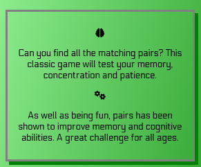
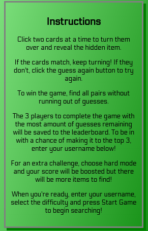
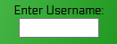
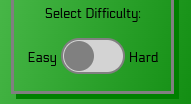

# Pairs
introduction

## Live Site 

## Repository 

## Author 
Alex Small

# UX
## Target Audience

 

## Project Goals

## User Stories
### Site User
As a user, I would like to :

- See clearly what the purpose of the game is
- Recieve clear and concise instructions as to how to navigate the site and play the game
- Easily navigate the site through eye catching buttons
- Be able to view my progress as I am playing the game
- Recieve prompts during the game to know what to do next
- Record my result and compare to other players
- Be able to exit the game or play again at the end of each game

### Website Owner
As a site owner, I would like to :

- Attract users to play the game through eye catching imagery, font and buttons
- Express ideas freely and creatively

## Design Choices
### Colors

### Typography

### Imagery

## Site Structure and Features

- Site structure here

Feature| Image | Value to User
:-------------------------:|:-------------------------: | :-------------------------: 
|About Section | |A clear and concise overview of the site, writen in a playful and fun way it captures the users attention and creates intrigue to play the game.
|Instructions| |Detailed instructions telling user the game rules as well as how to easily navigate through the site.
|Username Input| |An input allowing the user to enter their chosen username, which allows them to compare their score to others on the leaderboard.
|Difficulty Switch| |Allows the user to set the difficulty to a level that is appropriate for them.
|Start Button| |Allows the user to easily navigate to the game page.
|Cards Area| |Allows the user to easily navigate to the game page.
|Score Tracking| |Allows the user to easily navigate to the game page.
|Exit Game Button| |Allows the user to easily navigate to the game page.
|Leaderboard| |Allows the user to easily navigate to the game page.
|New Game Button| |Allows the user to easily navigate to the game page.
|Try Again Button| |Allows the user to easily navigate to the game page.
### Media Queries ###

## Future Features

## Testing
Testing is detailed fully in [TESTING.MD](https://github.com/AlexSmall96/Pair-Matching-Game/blob/main/TESTING.md)

## Frameworks, Libraries & Programs Used

- fontawesome
- gitpod
- github
- google fonts
- Coolors.co
- amiresponsive

# Deployment

The site was deployed to GitHub pages. The steps to deploy are as follows:
- In the GitHub repository, navigate to the Settings tab.
- From the source section drop-down menu, select the Master Branch.
- Once the master branch has been selected, the page will be automatically refreshed with a detailed ribbon display to indicate the successful deployment.
-Add info about forking

# Credits
## Content
The content of the site is all original thought, however the game itself is based on the classic card game [Concentration](https://en.wikipedia.org/wiki/Concentration_(card_game)) (also known as Pairs or Pelmanism)
## Media

## Code
The resources used for this project were the Javascript Essentials module, HTML & CSS Essentials module, the Love Running and Love Maths walkthrough projects, along with some external resources:

- The code which sorts the leaderboard based on users scores is taken from an article from [medium.com](https://medium.com/@gmcharmy/sort-objects-in-javascript-e-c-how-to-get-sorted-values-from-an-object-142a9ae7157c).

- The difficulty switch on the home page is styled with inspiration from a guide found at [geeksforgeeks](https://www.geeksforgeeks.org/how-to-create-toggle-switch-by-using-html-and-css/).

- The CSS background effects were taken from a section on [W3schools](https://www.w3schools.com/css/css3_gradients.asp) and a thread on [Stack Overflow](https://stackoverflow.com/questions/2869212/css3-gradient-background-set-on-body-doesnt-stretch-but-instead-repeats/) 

- All external resources are commented in the code at the relevant places.

## Acknowledgements 
I would like to thank my mentor Harry Dhillon for his encouraging support and detailed feedback throughout this project.