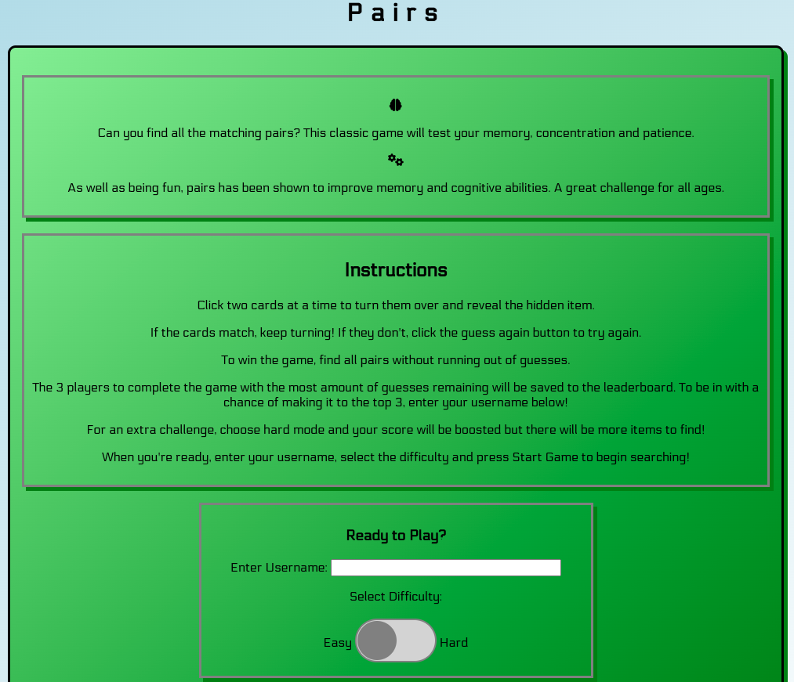
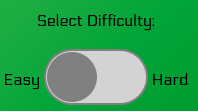
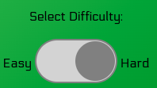

## Testing
### Manual Testing

#### Home Page 

| Test | Category         | Expected Result                     | Actual Result                                              | Pass/Fail |
|------|------------------|-------------------------------------|------------------------------------------------------------|-----------|
| 1.1   | Deployed Website | Home Page loads without any issues  | Home Page loads as expected                                | Pass      |
| 1.2    | Images and font  | Chosen font appears correctly       | All text is in Google font 'Electrolyse' as expected       | Pass      |
| 1.3    | Images and font  | Font Awesome icons load correctly   | Brain and cog icon appear in first paragraph as expected   | Pass      |
| 1.4    | User Input       | User can type username in input     | User can click on the input and type in any value          | Pass      |
| 1.5    | User Input       | User can toggle difficulty switch   | User can change switch from easy to hard, and back to easy | Pass      |
| 1.6    | User Input       | User can click 'Start Game' button  | Button is clickable                                        | Pass      |
| 1.7    | Logic            | 'Start Game' button loads game page | Game page appears upon clicking button                     | Pass      |

- 1.1-1.3

- 1.4 

- 1.5 

#### Game Page
| Test | Category        | Expected Result                                                                      | Actual Result                                                                                              | Pass/Fail |
|------|-----------------|--------------------------------------------------------------------------------------|------------------------------------------------------------------------------------------------------------|-----------|
| 2.1    | Screen Loading  | Game page loads without any issues                                                   | Game page loads as expected                                                                                | Pass      |
| 2.2    | Screen Loading  | Header remains above game play area when game page is loaded                                                 | Header remains as expected                                                                                | Pass      |
| 2.3    | Images and font | Chosen font appears correctly                                                        | All text is in Google font 'Electrolyse' as expected                                                       | Pass      |
| 2.4    | Images and font | Font Awesome icons load correctly                                                    | Question mark icons in 'Items Found' box appear as expected                                                | Pass      |
| 2.5    | Logic           | Switching to easy mode changes card layout, Items Found box and Attempts Left value. | 12 cards appear, Attempts Left value is 25, and 6 question marks appear in 'Items Found' box as expected.  | Pass      |
| 2.6    | Logic           | Switching to hard mode changes card layout, Items Found box and Attempts Left value. | 20 cards appear, Attempts Left value is 50, and 10 question marks appear in 'Items Found' box as expected. | Pass      |
| 2.7    | Logic           | Game page loads with cards face down (showing question mark)                         | In both difficulty modes, all cards appear with question mark when game page is loaded                     | Pass      |
| 2.8    | Logic           | 'Found Items' resets to none                                                         | In both difficulty modes, all icons in box load as question marks                                          | Pass      |
| 2.9    | Logic           | Prompt under cards loads loads as 'Pick a Card!'                                     | Text appears as expected                                                                                   | Pass      |
| 2.10    | Logic           | Leaderboard is blank on first loading, even if username has been entered             | Username can be entered and leaderboard is blank when game is first loaded.                                | Pass      |
- 1.7,2.1,2.2,2.3,2.4,2.5

-
### Game Play
#### Card Area
| Test | Category       | Expected Result                                                                                                                                                | Actual Result                                                                                                                                            | Pass/Fail |
|------|----------------|----------------------------------------------------------------------------------------------------------------------------------------------------------------|----------------------------------------------------------------------------------------------------------------------------------------------------------|-----------|
| 3.1  | Logic          | In each attempt, any two cards can be selected                                                                                                                 | User can click on any two cards, and question mark turns into specific icon.                                                                             | Pass      |
| 3.2  | Logic          | If cards match, a well done message appears                                                                                                                    | Any matching pair results in a message appearing saying 'well done!' and the number of items left to find is given.                                      | Pass      |
| 3.3  | Logic          | If cards match, user can continue to click on another pair                                                                                                     | When cards match and prompt message appears, user can click on any two cards other than a pair that has already been matched.                            | Pass      |
| 3.4  | Logic          | Cards that are turned over and match remain turned over                                                                                                        | If matching pair is found, they stay turned over until exit game button is clicked and new game is run. See test (2.6, 3.19)                                                         | Pass      |
| 3.5  | Logic          | Matched pairs can't be turned back over                                                                                                                        | If user clicks on a card that has been matched, nothing happens                                                                                          | Pass      |
| 3.6  | Logic          | If an attempt is incorrect, a guess again button appears                                                                                                       | If user selects two cards that don't match, prompt message dissapear and guess again button appears                                                      | Pass      |
| 3.7  | Logic          | When guess again button appears, user cannot click on any other cards untill button is clicked.                                                                | If user selects any cards before clicking guess again button, nothing happens.                                                                           |  Pass         |
| 3.8  | Logic          | Clicking guess again button turns the unmatched pair back over                                                                                                 | The last two cards selected turn back over                                                                                                               | Pass          |
| 3.9  | Logic          | Guess again button disappears when it is clicked                                                                                                               | When user clicks button, it disappears and there is no prompt message                                                                                    |  Pass         |Pass
| 3.10 | Logic          | If attempts left becomes less than number of items left to find, a message appears stating 'Sorry not enough guesses remaining' and a Try Again button appears | Message and button appear as expected when case occurs                                                                                                   |Pass           |
| 3.11 | Logic          | If attempts left becomes less than number of items left to find, user cannot turn over any more cards until a new game is started                              | When case occurs and message and button have appeared, clicking on any further cards does nothing                                                        |  Pass         |
| 3.12 | Logic          | Clicking Try Again button takes the user back to the settings section of the home page                                                                         | On clicking the Try Again button, the game page dissapears and the settings section of the home page appears with instructions and about sections hidden |  Pass         |
| 3.13 | Screen Loading | Header remains above home page area when try again button is clicked                                                                                           | Header remains as expected                                                                                                                               |  Pass         |
| 3.14 | Screen Loading | Username, difficulty switch and Start Game button all appear when try again button is clicked    |Features appear as expected|Pass|
| 3.15 | User Input | Username can be inputted into box on settings only version of home page     | Input accepts any value                                                                           | Pass      |
| 3.15 | User Input | Difficulty switch can be toggled on settings only version of home page      | Switch can be toggled between easy and hard as expected                                           | Pass      |
| 3.16 | User Input | Start Game button can be clicked on settings only version of home page      | Button can be clicked and loads game page as expected                                             | Pass      |
| 3.17 | Logic      | Difficulty switch on settings only version of home page changes card layout | When game page is loaded, difficulty settings act in the same way as starting from full home page |     Pass      |
| 3.18 | Logic      | Once all items are found, a well done message appears and user cannot change any further cards | When game is won, message appears as expected, cards cannot be changed and exit game button can be clicked|     Pass      |
| 3.19 | Logic      | Exit game button takes the user back to the home screen and all settings can be changed |Home screen loads as expected and username and difficulty can be selected|     Pass      |
| 3.19 | Logic      | If try again button was clicked during game, exit game button takes the user back to full home screen |Home screen loads in full after game with try again button clicked|     Pass      |
| 3.20 | Logic      | Username and difficulty can be changed for a new game |If difficulty is changed, card layout, items found box and attempts left value all change accordingly|     Pass      |
| 3.21 | Logic      | User can click exit game button at any point and return to home screen |Exit game button returns user to home screen at any point as expected|     Pass      |
#### Found Items Area
| Test | Category | Expected Result                                                  | Actual Result                                                                                                                   | Pass/Fail |
|------|----------|------------------------------------------------------------------|---------------------------------------------------------------------------------------------------------------------------------|-----------|
| 4.1  | Logic    | After an attempt has been made, the Attempts Left decreases by 1 | Once the user has selected two cards, the value drops by 1                                                                      | Pass      |
| 4.2  | Logic    | If cards match, the item appears in Items Found box              | Once the user has selected two cards and they match, a question mark in Items Found box is replaced with the corresponding item | Pass      |

#### Leaderboard
| Test | Category | Expected Result                                                                                                                                             | Actual Result                                                                                                              | Pass/Fail |
|------|----------|-------------------------------------------------------------------------------------------------------------------------------------------------------------|----------------------------------------------------------------------------------------------------------------------------|-----------|
| 5.1  | Logic    | The first user to enter a username and complete the game has their username and score saved to 1st place on the leaderboard.                                | Username and score appear in 1st place upon completing game                                                                | Pass      |
| 5.2  | Logic    | Subsequent users who enter a username and complete the game are ranked on the leader board accordingly.                                                     | Users are ranked according to score and appear as expected on the leader board                                             | Pass      |
| 5.3  | Logic    | If a user beats another's score, the order on the board changes                                                                                             | User achieves a score higher than one on the board and displaces current position                                          | Pass      |
| 5.4  | Logic    | If a user ties with another's score, they do not displace their position on the board                                                                       | User achieves same score as currently on board, does not displace current position but is ranked beneath on the board      | Pass      |
| 5.5  | Logic    | If a user's score is less than or equal to the current 3rd place, the user doesn't appear on the board.                                                     | User enters username and completes game but score is lower than current 3rd place so does not appear on board              | Pass      |
| 5.6  | Logic    | If a user completes the game on hard mode, their score is multiplied by 1.5 and is ranked on the leader board as usual                                      | User completes game on hard mode and score is multiplied by 1.5, displacing current 1st place                              | Pass      |
| 5.7  | Logic    | If a user attempts the game again with the same username, and beats their previous score, this is overwritten in the leaderboard                            | User enters a previously used username, achieves a higher score and overwrites previous score on leader board              | Pass      |
| 5.8  | Logic    | If a user attempts the game again with the same username on a different difficulty, and beats their previous score, this is overwritten on the leader board | User enters previously used username, selects hard mode and beats previous score, new score is overwritten on leader board | Pass      |
| 5.9  | Logic    | If a user attempts the game again with the same username on a different difficulty, and beats their previous score, this is overwritten on the leader board | User enters previously used username, selects hard mode and beats previous score, new score is overwritten on leader board | Pass      |

### Responsiveness

### User Stories Testing

## Validation Testing

### CSS Validation

### HTML Validation

### JS Validation 